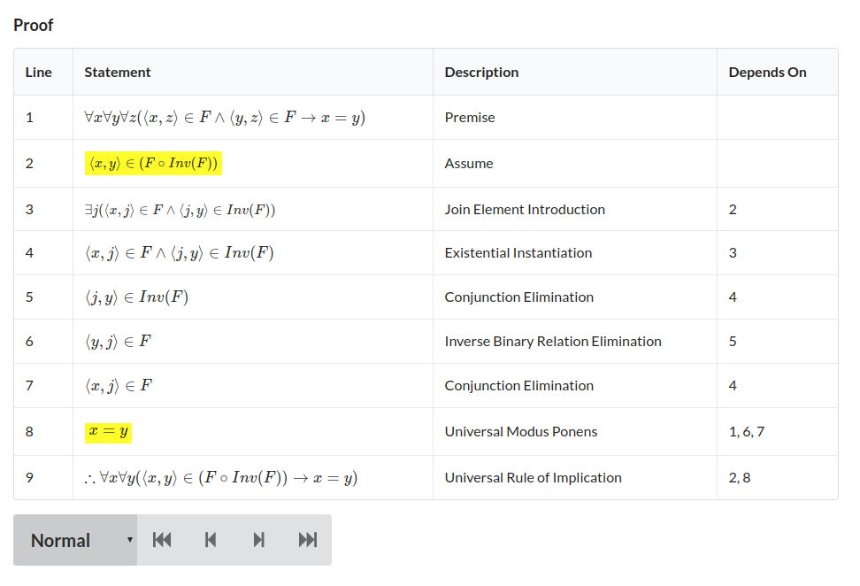
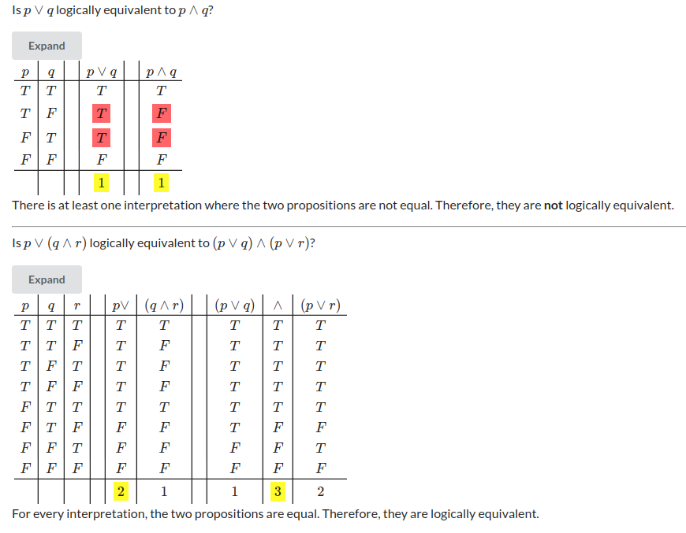
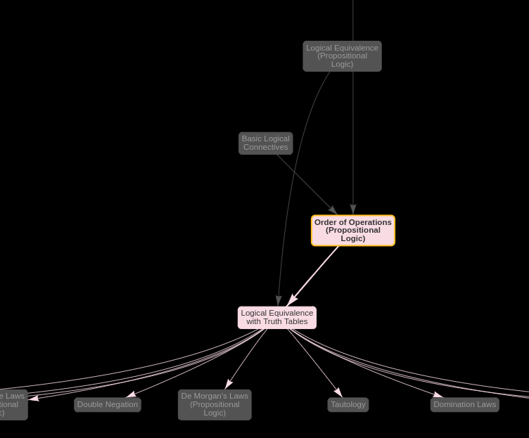
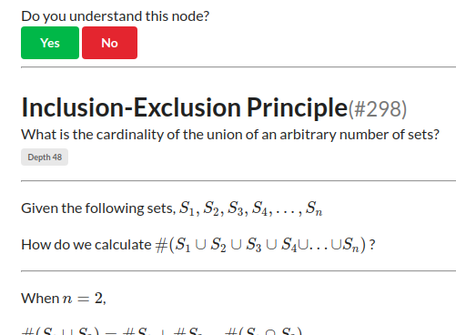

### `knowledge-dag`

Representing knowledge with a directed acyclic graph means
we avoid the following problem,

+ You must learn A to learn B
+ You must learn B to learn A

Each bit of information is a `node`.

Prerequisite knowledge is marked with a `directed edge`.

This project forbids cycles.

-----

This project is still in development but is already functional.

-----

### Features

+ Each `node` can be labelled with custom tags.
+ Search by title, tag, or both
+ Custom textbooks may be generated to grasp unfamiliar topics
+ [vis.js](https://visjs.org/) is used to render the knowledge graphs
+ [flavormark](https://github.com/AnyhowStep/flavormark) is used to parse content
+ [MathJax](https://github.com/mathjax/MathJax) is used to render math
+ [hljs](https://github.com/highlightjs/) is used to render code
+ Custom Markdown elements that generate truth tables, and tableau proofs

-----

### Requirements

This project was developed for,

+ MySQL 5.7
+ node v13.8.0

Other versions of MySQL and node may work fine, too.

-----

### Development

1. `git clone https://github.com/AnyhowStep/knowledge-dag`
1. `cd knowledge-dag`
1. `npm install`
1. `cp development.sample.env development.env`
1. Configure `development.env`
1. `cp client-config.sample.json client-config.json`
1. Configure `client-config.json`
1. `npm run watch`
   If this step fails,
   1. `npm install --save-dev typescript@3.5.1`
   1. Retry `npm run watch`
1. `WATCH=TRUE npm run webpack-dev`
1. `ENV=development.env npm run migrate-up-to-latest`
1. `npm run start-dev`

-----

### Configuring `development.env`

```
MYSQL_HOST="localhost"
MYSQL_DATABASE="knowledge-dag"
MYSQL_PORT=3306

# The migrator user is used to run SQL migrations
MIGRATOR_MYSQL_USERNAME="knowledge-dag-migrator"
MIGRATOR_MYSQL_PASSWORD="provide-your-own-password"

# The user is used by the server
# GRANT SELECT, INSERT, UPDATE, DELETE
MYSQL_USERNAME="knowledge-dag"
MYSQL_PASSWORD="provide-your-own-password"

# Make this a very long and random string
# If someone guesses your access token, they will have write access
ACCESS_TOKEN="provide-your-own"

# The port the server will run on
PORT=8228

#If you have an SSL cert you want to use with the server
#SSL_KEY_PATH
#SSL_CERT_PATH
#SSL_CA_PATH
```

-----

### Configuring `client-config.json`

```js
{
    //The hostname of the server
    "SERVER_ROOT" : "http://localhost:8228",
    //The API root, normally just `"/api"`
    "API_ROOT" : "/api"
}
```

-----

### MathJax

This project uses [MathJax](https://github.com/mathjax/MathJax) to render math

1. `cd client`
1. `git clone https://github.com/AnyhowStep/MathJax.git`
   (or the actual MathJax repo; https://github.com/mathjax/MathJax)

-----

### Screenshots

A rendered tableau proof,


A rendered truth table,


The knowledge graph around certain nodes,


The textbook builder, asking questions to generate a personalized textbook,

